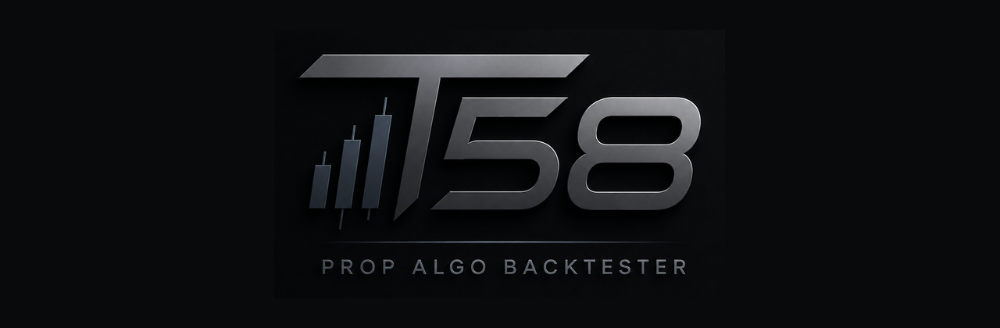

<div align="center">



# T58 Quant Algo Backtester

**Stop backtesting strategies. Start validating them.**

A prop-firm-first research and validation platform that takes a trading
idea from "here's a script" to a statistically stress-tested, prop-ready
system — without leaving one app.

[](https://whop.com/t58-trading/t58-backtesting-engine/)
[](LICENSE.md)
[](PROOF_OF_PERFORMANCE.md)

[**▶ Start Your Free Trial**](https://whop.com/t58-trading/t58-backtesting-engine/) · [Features](FEATURES.md) · [Proof & Testing](PROOF_OF_PERFORMANCE.md) · [Testimonials](TESTIMONIALS.md) · [FAQ](FAQ.md)

</div>

---

## ⚠️ This is a public information repo, not the source code

This repository exists so anyone considering T58 can see exactly what
they're buying, how it works, and how it's been tested — **before**
purchasing. It contains documentation, licensing terms, and proof of
testing rigor only.

**The actual application (source code, strategy engine, GA/search
internals) is closed-source and proprietary to T58 Trading.** Access to
the working software is provided exclusively through the official Whop
listing below — there is no public download, fork, or clone of the real
engine, and no version of it will ever be published to this repository.

**→ Get the actual app here: [whop.com/t58-trading/t58-backtesting-engine](https://whop.com/t58-trading/t58-backtesting-engine/)**

---

## The one question this app answers

> **"If I trade this strategy under these exact prop-firm rules, what is
> the probability that I pass the evaluation and reach my first payout?"**

Most "backtesters" stop at a profit curve on historical data. T58 treats
that as the *starting* point, not the answer. Every strategy you bring in
gets run through the same pipeline:

```
Market Data + Strategy + Risk Settings + Prop-Firm Rules
        → Historical Backtest
        → Prop-Firm Simulation (daily loss / drawdown / consistency rules enforced)
        → Monte Carlo Simulation (thousands of simulated account paths)
        → Probability of Passing the Eval, and Probability of Reaching Payout
        → One Comprehensive Report
```

No flat "this strategy made 34% last year." A distribution of outcomes,
under the exact rules of the firm you're actually funding through.

## Who this is for

- **Prop firm traders** who are tired of guessing whether a strategy will
  actually survive an evaluation before spending another challenge fee
  finding out the hard way.
- **Algo / systematic traders** who want real statistical validation —
  walk-forward, out-of-sample holdouts, overfitting checks — instead of a
  single curve-fit backtest.
- **Strategy builders of any skill level** — a no-code visual builder for
  non-programmers, and real parsers for Python, PineScript, and MQL5 for
  people who already have code.

This is **not** a signal service, a "guaranteed profit" tool, or a
plug-and-play EA. It's a research and validation platform: it tells you,
with numbers, how much you should trust an idea before you risk real
capital or a real evaluation fee on it.

## What's actually in the box

| Stage | What it does |
|---|---|
| **Create** | Import a strategy in 4 formats (visual no-code builder, Python, PineScript, MQL5), or use Speed Run / AI-assisted drafting to generate candidates from scratch. |
| **Test** | Run the full backtest → prop-sim → Monte Carlo pipeline; get a funnel of pass/funded/payout probabilities, not one number. |
| **Optimize** | A 5-stage Search Lab funnel, a full genetic-algorithm Evolution Lab with checkpoint/resume, NSGA-II multi-objective optimization, and a one-click Full Pipeline verdict (READY / MARGINAL / NOT READY). |
| **Validate** | Walk-forward optimization, walk-forward-aware GA, Combinatorial Purged Cross-Validation (CPCV), Probability of Backtest Overfitting (PBO), parameter sensitivity, and regime survival analysis. |
| **Champion** | Multi-asset portfolios, multi-strategy ensembles, and automated portfolio composition across your strategy library. |
| **Deploy** | Forward-test on an MT5 demo account, overnight autopilot discovery-to-forward-test, and drift-triggered auto-retuning. |

Full breakdown of every tool: **[FEATURES.md](FEATURES.md)**

## Built the hard way, not the fast way

This isn't a weekend project wrapped in a landing page. It's a platform
with a genetic-algorithm evolution engine, a combinatorial cross-validation
suite, and a 1,000+ test regression suite that has been repeatedly
stress-tested against its own worst-case bugs — lookahead leaks,
instrument pip-size mismatches, position-sizing errors, and
overfitting blind spots — and fixed for real, not patched around.

See exactly what that testing looked like: **[PROOF_OF_PERFORMANCE.md](PROOF_OF_PERFORMANCE.md)**

## Three ways to run it

- **Windows desktop app** — full-featured native app, no Python required.
- **Local Python app** — same engine, any OS.
- **Mobile-friendly web app** — check on a search, evolution run, or report
  from your phone.

One engine powers all three, so there's no feature drift between them —
what you validate on desktop is exactly what you'll see on mobile.

## Pricing & access

T58 Quant Algo Backtester is available exclusively through Whop, with a
free trial so you can put it through its paces before committing.

**→ [whop.com/t58-trading/t58-backtesting-engine](https://whop.com/t58-trading/t58-backtesting-engine/)**

Pricing, trial length, and any current promotions are kept current on the
Whop listing itself rather than duplicated here — that's the source of
truth.

## FAQ

Common questions about what's included, supported formats, requirements,
and what T58 is (and isn't) are answered in **[FAQ.md](FAQ.md)**.

## What buyers are saying

A handful of early feedback is collected in **[TESTIMONIALS.md](TESTIMONIALS.md)**.

## License

This documentation repository is provided for informational purposes
only. It is **not** an open-source release of the T58 application. See
**[LICENSE.md](LICENSE.md)** for full terms.

## Disclaimer

Simulated results (backtests, Monte Carlo runs, walk-forward validation)
are estimates derived from historical data and statistical resampling.
Past performance and simulated outcomes do not guarantee future results.
Trading involves substantial risk of loss. T58 Trading is a research and
validation tool, not financial advice, and not a guarantee of prop-firm
evaluation success.

---

<div align="center">

**[Start your free trial →](https://whop.com/t58-trading/t58-backtesting-engine/)**

</div>
