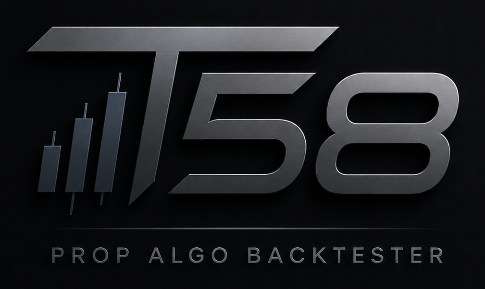

# Testimonials

> **Template notice:** the quotes below are placeholder copy — written to
> show the format, tone, and layout real testimonials will use. They are
> **not** from real customers. Replace each block with a genuine
> testimonial (name/handle, a real quote, and what they used T58 for) as
> they come in. Delete this notice once real testimonials are in place.

---

> "I burned three eval fees on strategies that looked great on a plain
> backtest and fell apart in week one. Running the same strategy through
> Search Lab and Full Pipeline before I paid for a fourth eval showed me
> exactly why the first three failed — the out-of-sample gap was obvious
> once it was in front of me."
>
> **— @quantsignal_dev**, funded trader

---

> "The Evolution Lab is the first optimizer I've used that doesn't just
> hand you the most overfit thing it can find. Watching Prop Fitness
> actually penalize thin sample sizes changed how I read every
> leaderboard I've ever looked at."
>
> **— M. Okafor**, systematic trader

---

> "I'm not a programmer. The Manual Builder plus the prop-firm
> quick-fill presets meant I could go from an idea on a napkin to a real
> Monte Carlo probability estimate in an afternoon, without learning
> Python first."
>
> **— @rangebreak_rae**, discretionary-to-systematic trader

---

> "CPCV and PBO are things I used to only see in academic papers. Having
> them sitting next to my own leaderboard, on my own strategies, is a
> different level of honesty than any retail backtester I've paid for
> before."
>
> **— D. Larsen**, independent quant

---

> "Forward-testing straight to an MT5 demo from the same engine that did
> the backtest, instead of re-coding the strategy for a different
> platform, saved me from at least one dumb translation bug I would have
> only found live."
>
> **— @fivepct_grinder**, prop firm trader

---

## Want to be featured here?

If T58 has helped your process, reach out through the official Whop page
— real testimonials replace the placeholders above as they come in.

**[whop.com/t58-trading/t58-backtesting-engine](https://whop.com/t58-trading/t58-backtesting-engine/)**
